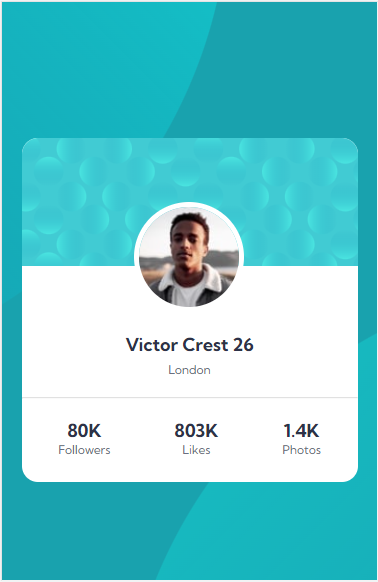
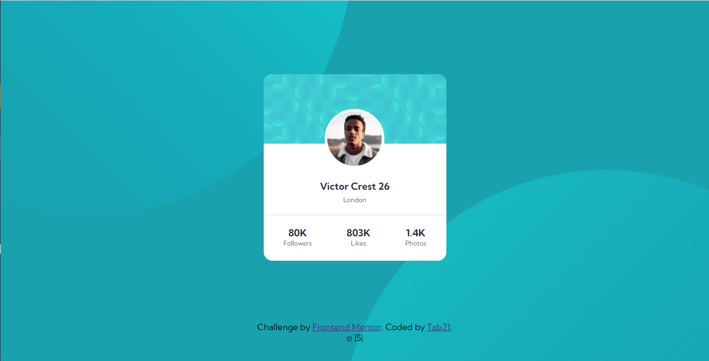

# Frontend Mentor - Profile card component solution

This is a solution to the [Profile card component challenge on Frontend Mentor](https://www.frontendmentor.io/challenges/profile-card-component-cfArpWshJ). Frontend Mentor challenges help you improve your coding skills by building realistic projects.

## Table of contents

- [Overview](#overview)
  - [The challenge](#the-challenge)
  - [Screenshot](#screenshot)
  - [Links](#links)
  - [Built with](#built-with)
- [Author](#author)

## Overview

### The challenge

- Build out the project to the designs provided in the design folder.

### Screenshot

### Links

- Solution URL: [solution on frontendmentor](https://www.frontendmentor.io/solutions/profile-card-using-html-and-css-fjvgDvYnH)
- Live Site URL: [live site](https://tab21.github.io/profile-card-with-CSS-and-HTML/)

### Built with

- HTML5
- CSS

## Author

- Frontend Mentor - [@tab21](https://www.frontendmentor.io/profile/tab21)
